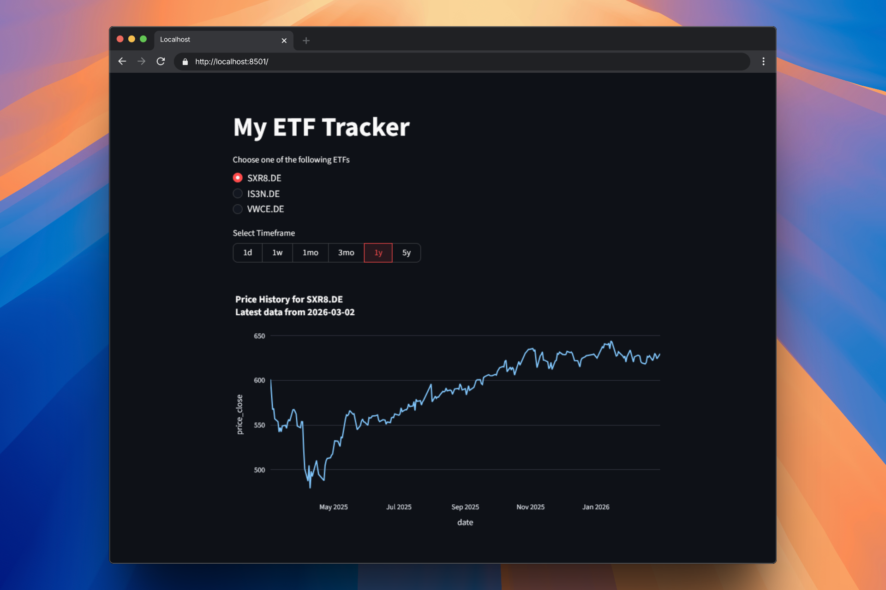

# ETF & Crypto Performance Tracker

An ETL pipeline and interactive dashboard designed to track, store, and visualize ETF/stock performance using Python, PostgreSQL, and Streamlit.

## Dashboard Preview


## Features
* **ETL Pipeline:** Automated data extraction from Yahoo Finance (`yfinance`).
* **Database Integration:** Robust storage in a PostgreSQL database using SQLAlchemy.
* **Interactive Dashboard:** Real-time data visualization with Streamlit and Plotly.
* **Secure Configuration:** Environment variables management via `.env` to protect sensitive database credentials.

## Tech Stack
* **Language:** Python 3.13
* **Database:** PostgreSQL
* **Dependencies:** Pandas, SQLAlchemy, Streamlit, Plotly, python-dotenv, yfinance.

## Project Structure
```text
ETF-Tracker/
├── src/
│   └── etf_tracker/
│       ├── app.py           # Streamlit Dashboard
│       ├── database.py      # Database Connection & Engine
│       ├── extract.py       # Data extraction from Yahoo Finance 
│       ├── transform.py     # Data transformation
│       └── db_setup.py      # Database Schema Initialization
├── main.py                  # ETL Pipeline (Data Fetching)
├── .env                     # Private Credentials (IGNORED BY GIT)
├── .env.example             # Template for Environment Variables
├── .gitignore               # Files to be ignored by Git
└── requirements.txt         # Project Dependencies
```

## Setup & Installation
1. Clone the Repository
```bash
git clone [https://github.com/Stauruss/ETF-Tracker.git](https://github.com/Stauruss/ETF-Tracker.git)
cd ETF-Tracker
```


2. Configure Environment Variables

Create a .env file in the root directory and add your PostgreSQL credentials:
```code
DB_USER=your_username
DB_PASS=your_password
DB_HOST=localhost
DB_PORT=5432
DB_NAME=your_db_name
TICKERS=SXR8.DE,IS3N.DE,VWCE.DE
```


3. Install Dependencies

It is recommended to use a virtual environment:
```bash
pip install -r requirements.txt
```


4. Initialize the Database

Run the setup script once to create the necessary tables with the correct schema:
```bash
python src/etf_tracker/db_setup.py
```

## Usage
1. Run the ETL Pipeline

To fetch the latest data and update the database:
```bash
python src/etf_tracker/main.py
```


2. Launch the Dashboard

To visualize your portfolio performance:
```bash
streamlit run src/etf_tracker/app.py
```

## License

This project is for educational purposes. Feel free to use and modify it.

